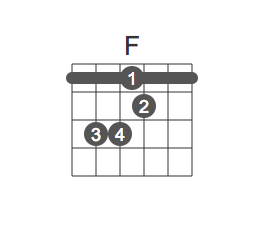
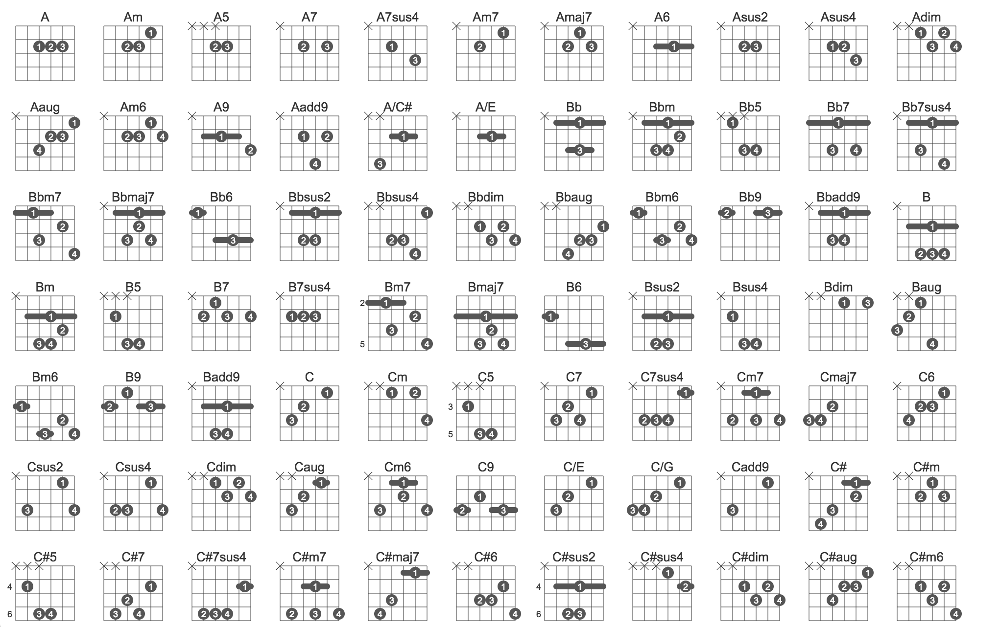
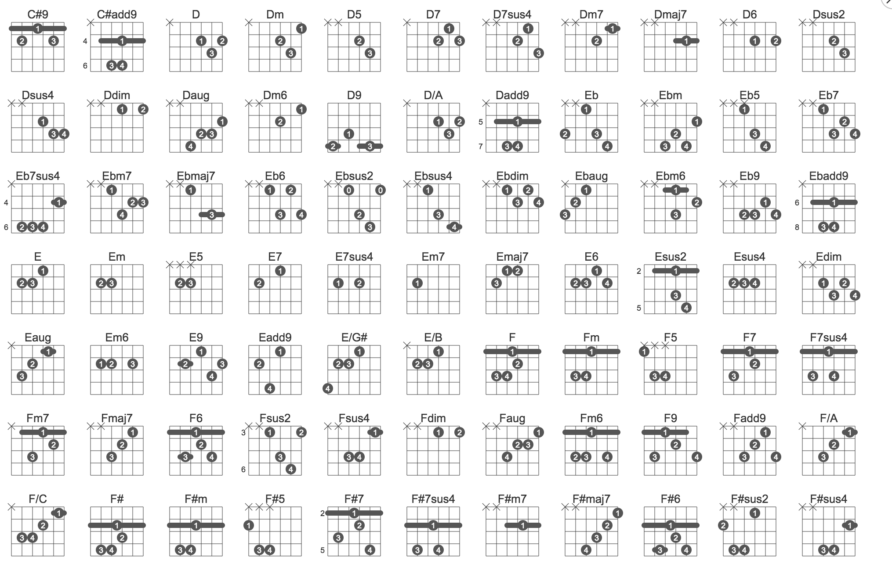
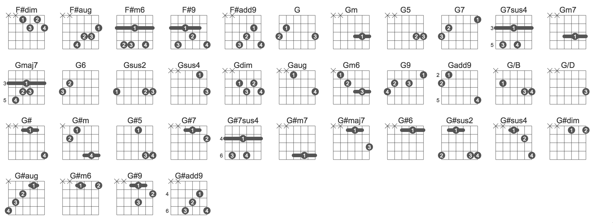
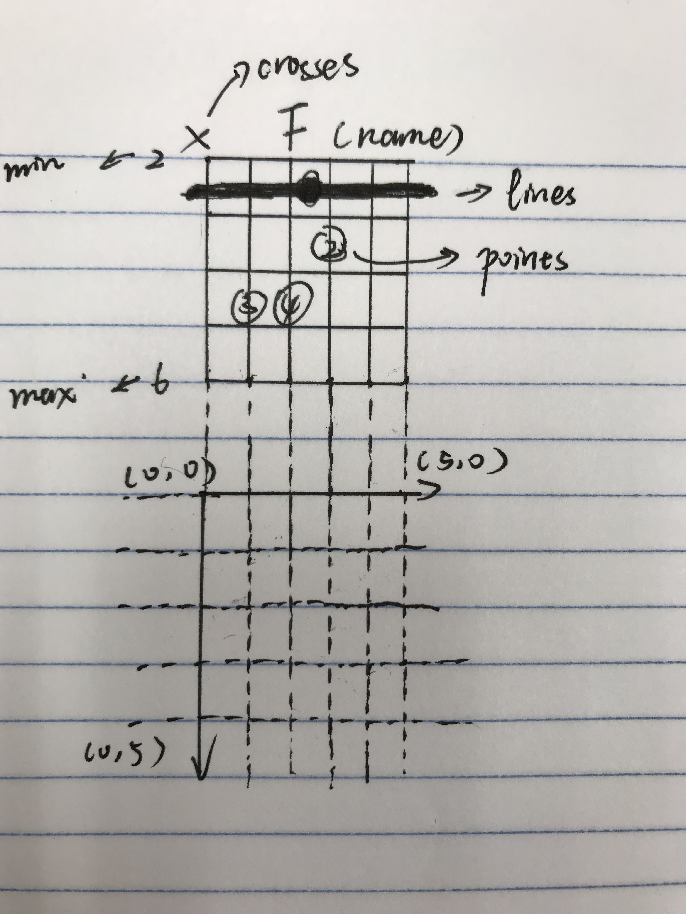

# react-chord-generator

Generator for generating chords of guitar or ukulele in the form of svg.
This project is a sub project of [Guitar-Editor](https://github.com/Haixiang6123/Guitar-Editor).

I got the inspiration from website [有谱么 (A Chinese guitar tabs website)](https://yoopu.me/home).
However, the ways we define a chord are totally different. It takes me
2 days to transfer all their chords data into mine. I have to say their way 
to define a chord is easier.

## Screenshot



## Directory

```
├── README.md
├── src
│   ├── App.js      # Entry point
│   ├── components  # Chord component & CustomChord component (Nested)
│   └── dataSource  # Chord data
└── yarn.lock
```

## How to use

`chordName` can be 'Am', 'C', 'Fm' ...

```html
<Chord chordName="F"/>
```

## All Chords







## Advanced

### How to define a chord

There is a component called CustomChord nested in Chord component. 
For this component, everything should be well defined by yourself.

`chord` should be an object like this:

```javascript 1.8
let chord = {
    "name": "F",
    "crosses": [],
    "points": [{"x": 1, "y": 2.5, "text": "3"}, {"x": 2, "y": 2.5, "text": "4"}, {"x": 3, "y": 1.5, "text": "2"}],
    "lines": [{"text": 1, "start": {"x": 0, "y": 0.5}, "end": {"x": 5, "y": 0.5}}],
    "min": {"text": "", "x": -1, "y": -1},
    "max": {"text": "", "x": -1, "y": -1}
}
```

Then put it into the component.

```html
<CustomChord chord={chord} />
```

The rules are as followed:



### Guitar tabs editor

If you like this project, maybe you love my [Guitar-Editor](https://github.com/Haixiang6123/Guitar-Editor).
You can edit a guitar tab with the online editor.
